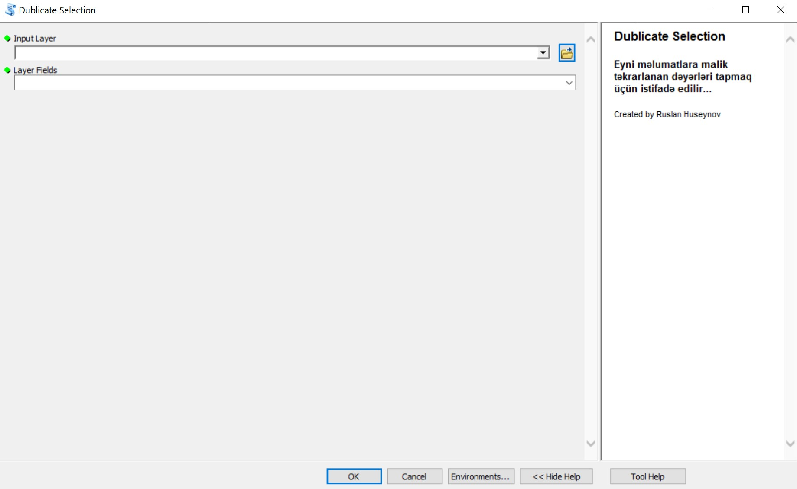
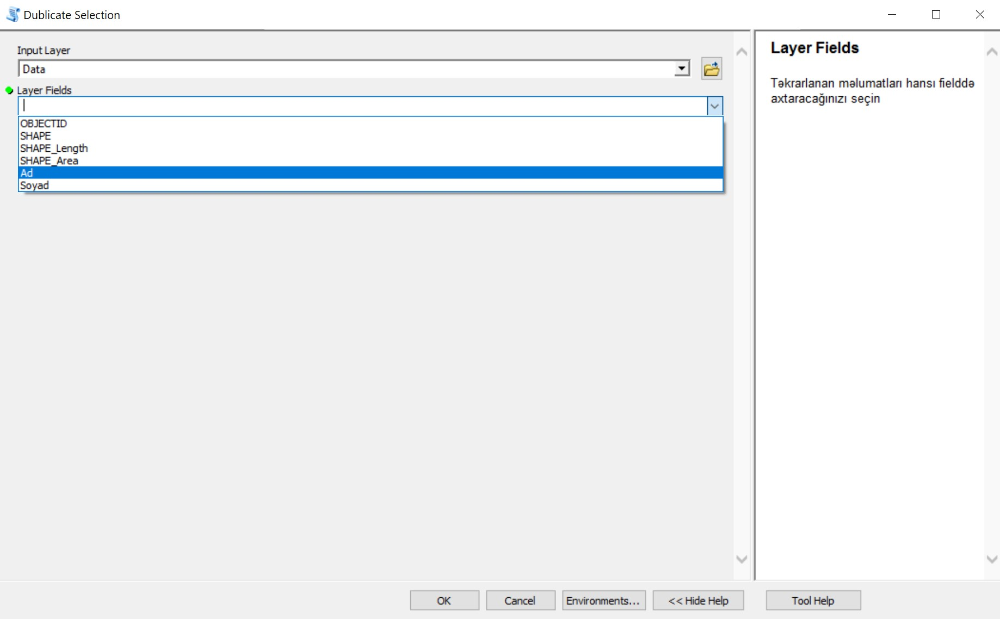
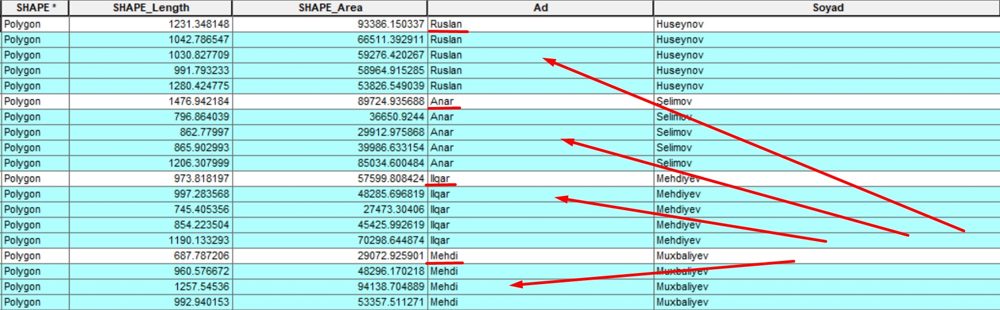

# Arcgis-Dublicates-Selection

## Məlumat

Bu alət, ArcGIS-də verilənlər dəstəsində təkrarlanan dəyərləri tapmaq və seçmək üçün istifadə olunur. Müxtəlif atributlar üzrə təkrarlanan dəyərləri aşkar etməyə kömək edir və verilənlər təmizləmə və analiz prosesində faydalıdır. Alət Python dilində yazılıb və ArcPy kitabxanası ilə ArcGIS mühiti ilə asanlıqla inteqrasiya olunur.

## Xüsusiyyətlər

Təkrarlanan Qeydləri Tapın: Müəyyən bir atributa əsaslanaraq sürətlə təkrarlanan dəyərləri müəyyən edir.
Təkrarlananları Seçin: Müəyyən bir sahədə təkrarlanan dəyərləri avtomatik olaraq seçir.
Xüsusiləşdirilə Bilən: Təkrarlanan dəyərləri tapmaq üçün istədiyiniz atributu seçə bilərsiniz.
Effektiv: Böyük verilənlər dəstələri ilə işləyərək verilənlər təmizləmə prosesini sürətləndirir.

